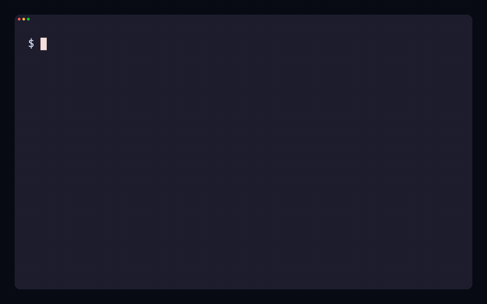
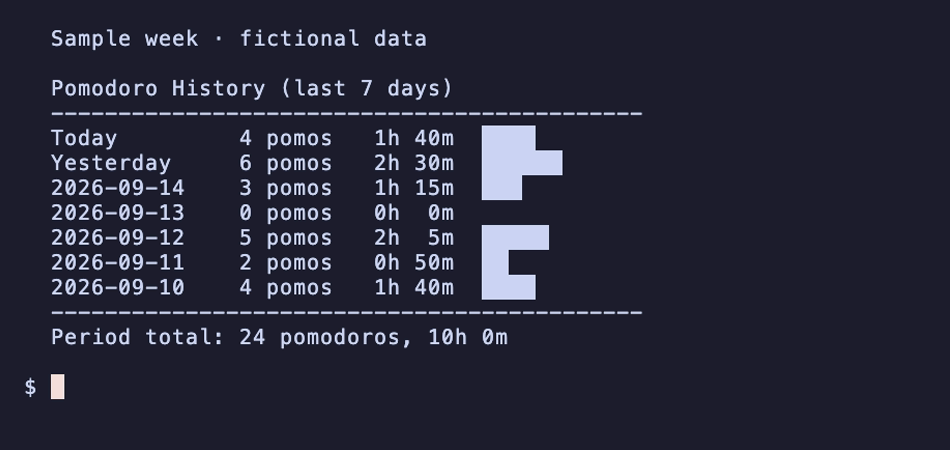

# Tomatui

[](https://github.com/Hiro-Chiba/tomatui/releases/latest)
[](https://crates.io/crates/tomatui)
[](https://github.com/Hiro-Chiba/tomatui/actions)
[](LICENSE)

**A little focus timer beside your editor.**

Keep your work, breaks, and completed sessions in the terminal. Use a big clock when you have room, or a single line in a small pane. Your focus history stays on your computer.

[Download](https://github.com/Hiro-Chiba/tomatui/releases/latest) · [日本語](README_ja.md) · [Changelog](CHANGELOG.md)



An eight-second demo with waiting time skipped. Work is red, breaks are green, and long breaks are blue; the block bar fills as time passes. Recorded with saved one-minute work and break settings and `on_end=ask`; defaults remain 25 minutes of work and 5 minutes of rest. [Watch the MP4](assets/demo.mp4).

> This README previews the development version. The short launch commands, new display, and controls shown here are available from source. Published v0.1.5 still uses `tomatui start` or `tomatui start -m`; see the [changelog](CHANGELOG.md).

## Get started

With Rust 1.93 or later, install the published version and start a timer:

```bash
cargo install --locked tomatui
tomatui start
```

No Rust? [Download a binary for your OS](https://github.com/Hiro-Chiba/tomatui/releases/latest).

<details>
<summary>Choose a binary and run it</summary>

| Your computer | Archive |
| --- | --- |
| macOS, Apple Silicon | [tomatui-aarch64-apple-darwin.tar.gz](https://github.com/Hiro-Chiba/tomatui/releases/latest/download/tomatui-aarch64-apple-darwin.tar.gz) |
| macOS, Intel | [tomatui-x86_64-apple-darwin.tar.gz](https://github.com/Hiro-Chiba/tomatui/releases/latest/download/tomatui-x86_64-apple-darwin.tar.gz) |
| Linux, x86-64 | [tomatui-x86_64-unknown-linux-gnu.tar.gz](https://github.com/Hiro-Chiba/tomatui/releases/latest/download/tomatui-x86_64-unknown-linux-gnu.tar.gz) |
| Windows, x86-64 | [tomatui-x86_64-pc-windows-msvc.zip](https://github.com/Hiro-Chiba/tomatui/releases/latest/download/tomatui-x86_64-pc-windows-msvc.zip) |

Extract the archive and open a terminal in that folder. On macOS or Linux, run `./tomatui start`. On Windows, open PowerShell and run `.\tomatui.exe start`. Press `q` to quit. Put the executable in a directory on your `PATH` to run `tomatui` from anywhere.

The Linux binary requires glibc 2.39 or newer. For older glibc or musl-based systems, install with Cargo to build for your environment. The prebuilt binaries do not require Rust or Cargo.

</details>

<details>
<summary>Try the development version shown here</summary>

With Rust 1.93 or later:

```bash
git clone https://github.com/Hiro-Chiba/tomatui.git
cd tomatui
cargo install --path . --locked
tomatui
```

This installs the checkout as your `tomatui` executable. The repository pins its development toolchain in `rust-toolchain.toml`.

</details>

## Make room for focus

Use a single line in any terminal, or keep it in a small pane beside your editor. One-line mode uses the same timer, controls, and saved statistics as the full display.

```bash
tomatui       # Full display
tomatui -m    # One-line display
```


A four-second demo using the same saved settings, with waiting time skipped. [Watch the MP4](assets/minimal.mp4).

## Take the next break on your terms

Work starts as soon as you launch the timer. By default, work and breaks continue automatically. Choose `ask` to wait at `00:00` when a phase finishes, or `quit` to exit when it finishes. When waiting, press `Enter` or `s` to start the next phase. Need another minute before the timer ends? Press `+` or `↑`.

Save your preferences once, then launch with just `tomatui` or `tomatui -m`:

```bash
tomatui config --on-end ask       # Save once: wait at each phase boundary
tomatui                          # Use your saved settings
```

To change your usual durations, use `tomatui config -w 30 -b 10`. For a single run, `tomatui --on-end quit` or `tomatui -w 30` overrides your saved settings.

The default rhythm is 25 minutes of work, a 5-minute break, and a 15-minute long break after every four sessions. Exiting shows a summary of the work completed during that run.

| Key | Action |
| --- | --- |
| `p` / `Space` | Pause or resume |
| `+` / `↑` | Add one minute to the current phase |
| `s` | Skip the current phase, or continue when waiting |
| `Enter` | Continue when waiting |
| `w` / `b` | Switch to work or break; pressing the current phase's key restarts it |
| `q` / `Esc` / `Ctrl+C` | Quit |

At `00:00` in `ask` mode, only continue and quit are active. Skipping moves directly to the next phase, regardless of the end-of-phase setting.

## See what you finished

Completed work sessions are saved locally. Check today's total, scan the past week, or look back over all your recorded sessions.

```bash
tomatui stats                   # Today
tomatui stats history           # Last 7 days
tomatui stats history --days 30  # Last 30 days
tomatui stats summary           # All-time summary
```



The screenshot uses sample data. Completed work includes any minutes added with `+`; skipped or interrupted work is not recorded. Skipping still advances the position in the work/break cycle, so the session indicator is a place in that cycle, not a count of completed work.

<details>
<summary>Settings, local files, and notifications</summary>

Run `tomatui config` to see your settings and exact config path. Save durations with `tomatui config -w 30 -b 10`, choose a phase-end policy with `tomatui config --on-end ask`, or restore defaults with `tomatui config --reset`. Launch options override saved settings for that run. The older `tomatui start` and `tomatui start -m` commands are still supported.

Configuration uses `tomatui/config.json` in the standard OS config directory. Its fields are `work_minutes`, `break_minutes`, `long_break_minutes`, `sessions`, and `on_end`. The `on_end` values are `start` (default), `ask`, and `quit`; older config files without this field keep automatic transitions.

Statistics use `tomatui/stats.json` in the standard OS data directory. `tomatui stats clear` immediately clears all saved statistics.

| OS | Config directory | Data directory |
| --- | --- | --- |
| Linux | `$XDG_CONFIG_HOME` or `~/.config` | `$XDG_DATA_HOME` or `~/.local/share` |
| macOS | `~/Library/Application Support` | `~/Library/Application Support` |
| Windows | `%APPDATA%` | `%APPDATA%` |

Desktop notifications are best effort on macOS and Linux. Linux requires `notify-send`. Windows and systems without desktop notification support use the terminal bell.

</details>

<details>
<summary>Development</summary>

See [architecture](docs/architecture.md) for timer and storage behavior, and [releasing](docs/releasing.md) for the release process. CI also checks the minimum Rust version declared in `Cargo.toml`. See [recording the demos](assets/README.md) to reproduce the GIFs and sample statistics.

```bash
cargo fmt --check
cargo clippy --locked --all-targets -- -D warnings
cargo test --locked
```

</details>

Design inspiration from [pomo](https://github.com/Bahaaio/pomo). Licensed under [MIT](LICENSE).
