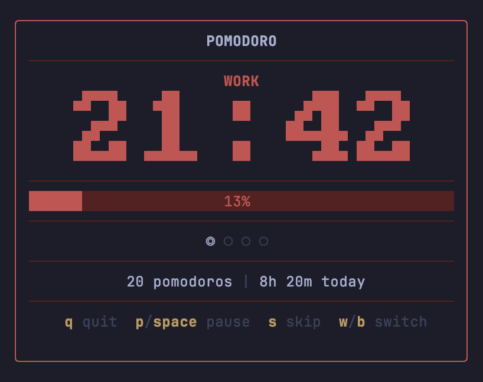
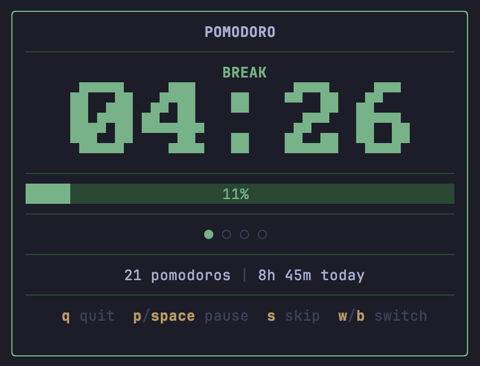
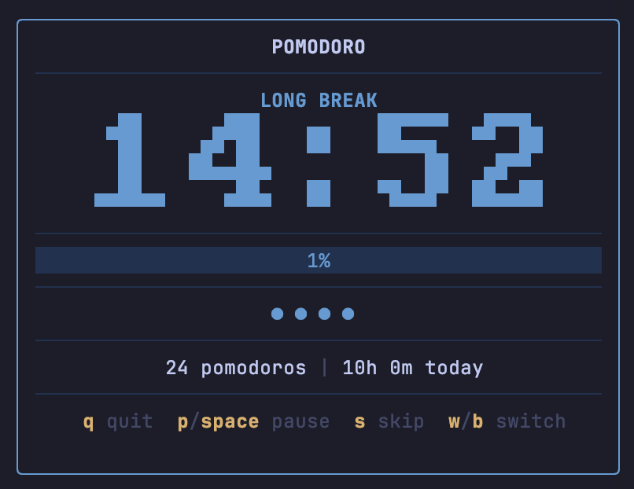

# Pomo

Rust製のターミナルポモドーロタイマー。

Work | Break | Long Break
:---:|:---:|:---:
 |  | 

## インストール

```bash
cargo install --path .
```

## 使い方

```bash
pomo start              # リッチTUI
pomo start -m           # ミニマル1行モード
pomo start -w 30 -b 10  # 作業/休憩時間を指定
pomo stats              # 今日の統計
pomo stats history      # 直近7日の履歴
pomo stats summary      # 全期間サマリー
pomo config -w 30       # 設定を保存
pomo config --reset     # デフォルトに戻す
```

## キー操作

`q` 終了 | `p`/`Space` 一時停止 | `s` スキップ | `w` Work | `b` Break

## ライセンス

MIT
